<h2 align="center">
    <a href="https://dainam.edu.vn/vi/khoa-cong-nghe-thong-tin">
    🎓 Faculty of Information Technology (DaiNam University)
    </a>
</h2>
<h2 align="center">
    Building a Movie Ticket Booking Management Web Application
</h2>
<div align="center">
    <p align="center">
        
        
        
    </p>

[](https://www.facebook.com/DNUAIoTLab)
[](https://dainam.edu.vn/vi/khoa-cong-nghe-thong-tin)
[](https://dainam.edu.vn)

</div>
Đây là bài tập lớn (BTL) cho học phần "Phát triển Phần mềm Mã nguồn mở". Dự án tập trung vào việc xây dựng một website quản lý và đặt vé xem phim trực tuyến hoàn chỉnh, sử dụng kiến trúc "thuần PHP" (Server-Side Rendering) kết hợp với CSDL MySQL.

## 📖 1. Giới thiệu

Trong bối cảnh công nghệ phát triển, nhu cầu giải trí và sự tiện lợi của người dùng ngày càng tăng.Các hệ thống đặt vé truyền thống tại quầy bộc lộ nhiều hạn chế như tốn thời gian xếp hàng, khó chọn được vị trí ưng ý.

**Mục tiêu của dự án** là giải quyết vấn đề này bằng cách xây dựng một hệ thống web:
1. **Phía Khách hàng:** Cung cấp trải nghiệm đặt vé mượt mà, trực quan, từ bước chọn phim, chọn suất chiếu, đến chọn ghế ngồi.
2. **Phía Quản trị:** Cung cấp một công cụ (Admin Panel) mạnh mẽ để quản lý toàn bộ nghiệp vụ của rạp (quản lý phim, suất chiếu, phòng chiếu).

## 🔧 2. Các công nghệ được sử dụng
<div align="center">

### Hệ điều hành

[](https://www.microsoft.com/en-us/windows/)
[](https://ubuntu.com/)

### Công nghệ chính
[](https://www.php.net/)
[](#)
[](#)
[](#)
[](#)
[](https://getbootstrap.com/)

### Web Server & Database
[](https://httpd.apache.org/)
[](https://www.mysql.com/) 
[](https://www.apachefriends.org/)

### Database Management Tools
[](https://dev.mysql.com/downloads/workbench/)
</div>
## 🚀 3. Hình ảnh các chức năng
## 1. Trang đăng nhập

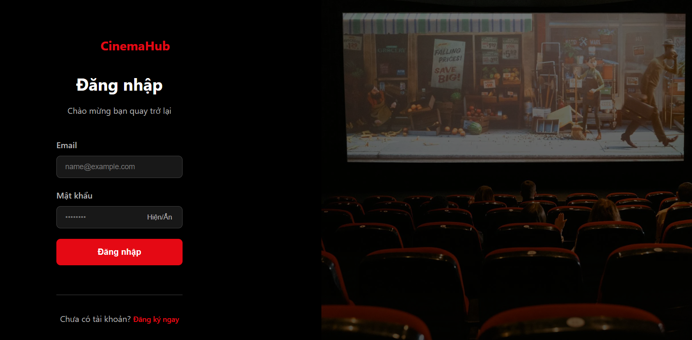

## 2. Trang dashboard admin

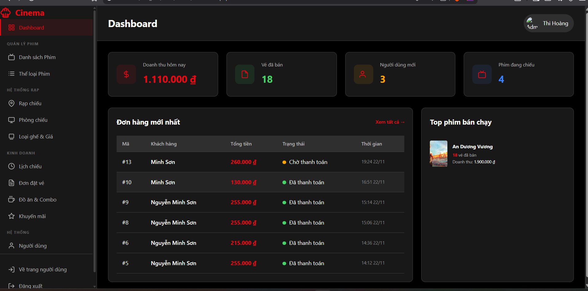

## 3. Trang Quản lý Phim

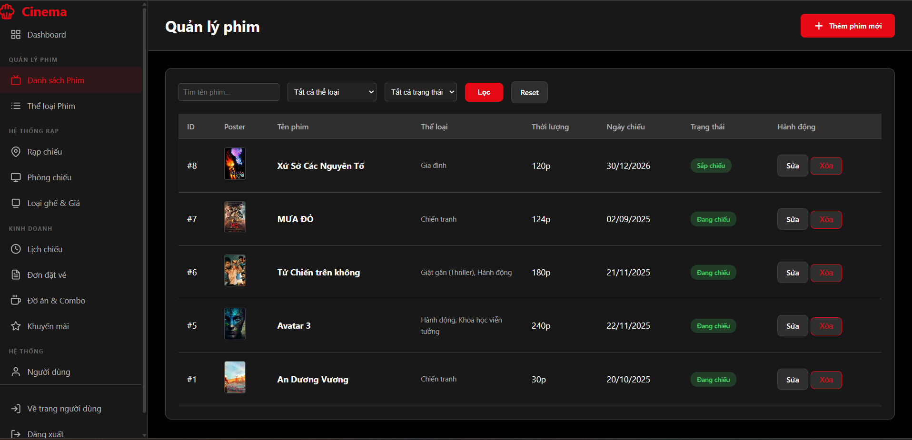

## 4. Trang Quản lý rạp chiếu

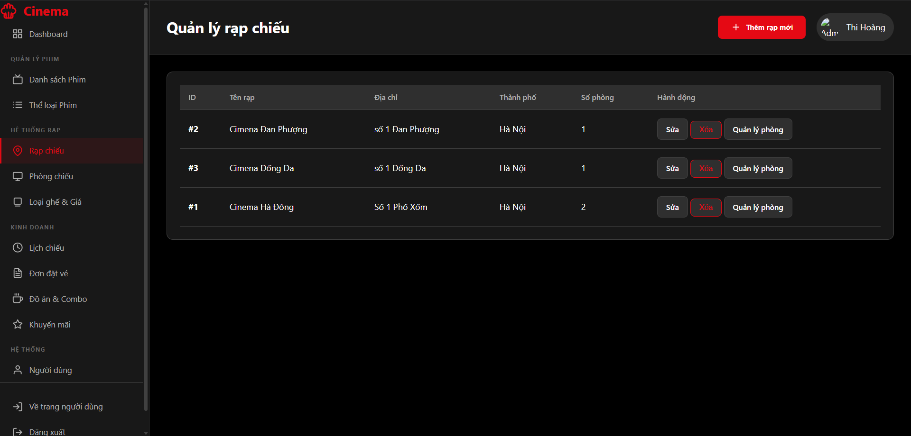

## 5. Trang Quản lý phòng chiếu

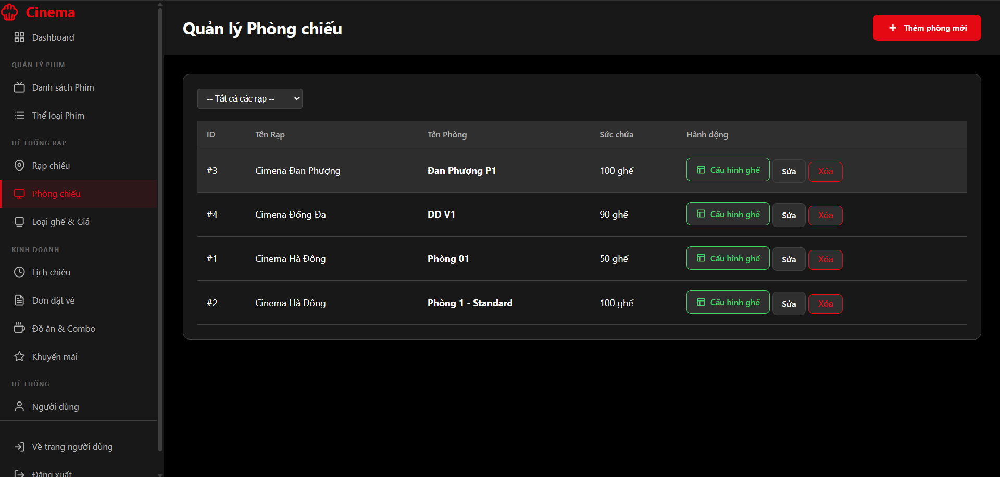

## 5. Trang Quản lý xuất chiếu

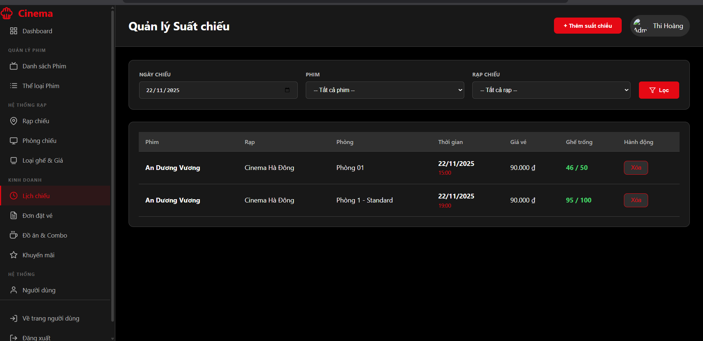

## 7. Trang Quản lý đơn hàng đặt vé xem phim

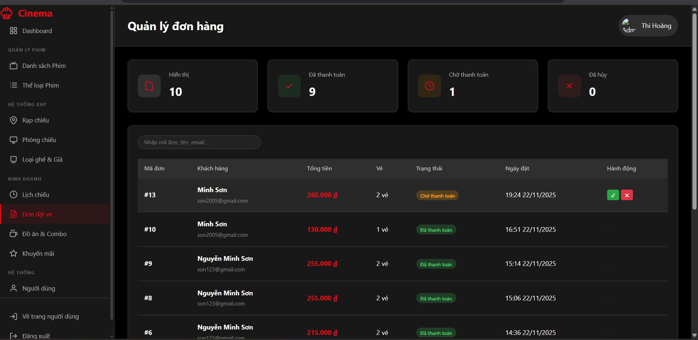

## 8. Trang Quản đồ ăn & combocombo

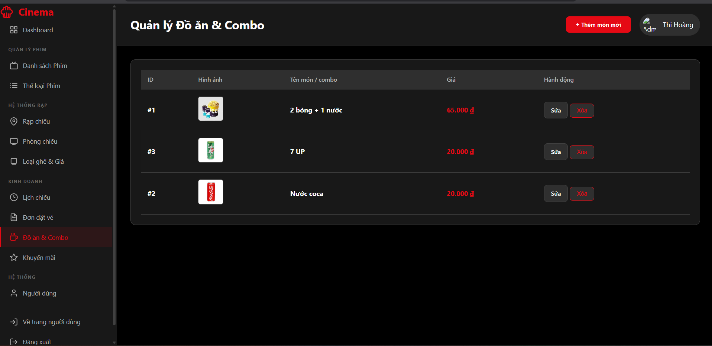

## 9. Trang Quản lý người dùng

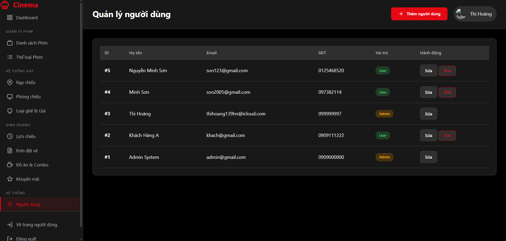

## 10. Trang chủ web

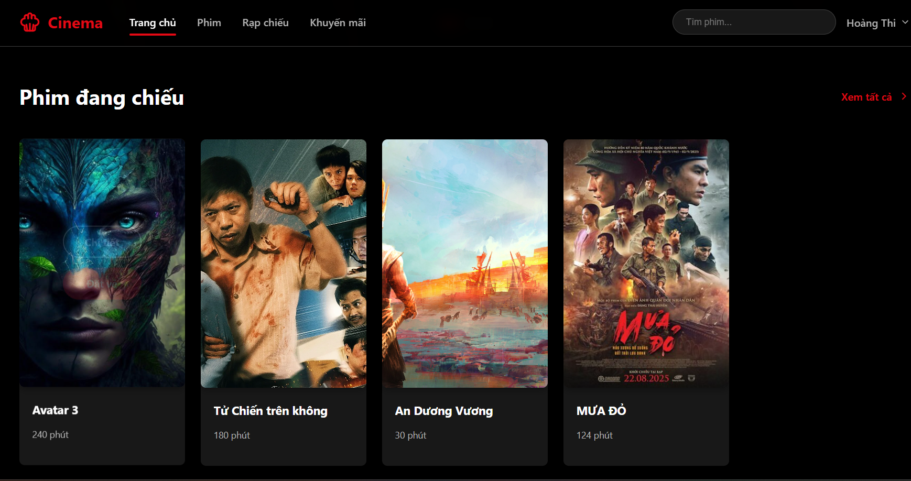

## 11. Trang chi tiết phim

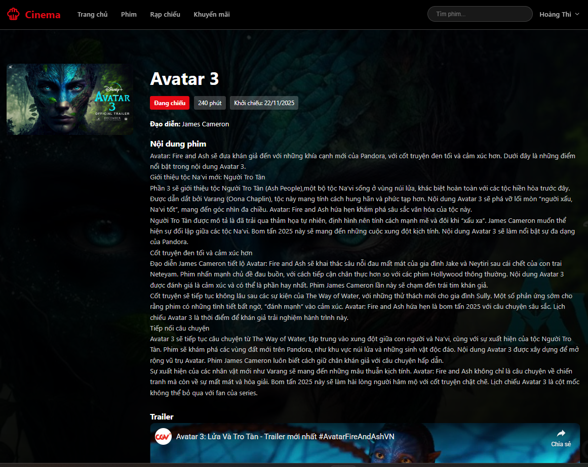

## 11. Trang chọn ghế xem phim
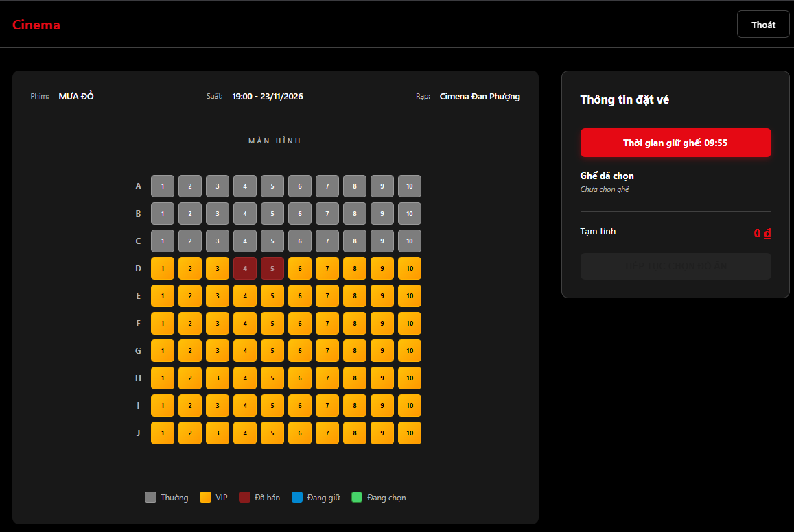

## 11. Trang chọn đồ ăn nước uống

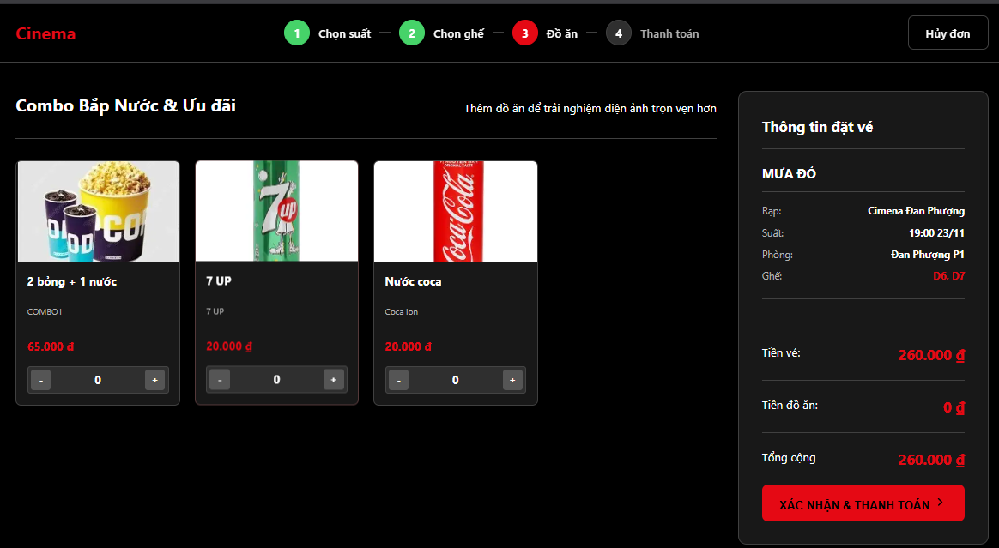

## 11. Trang chọn phương thức thanh toántoán

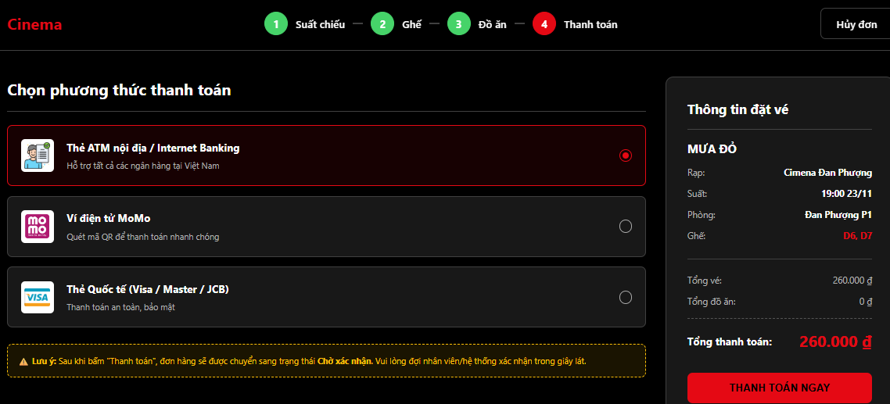

## 11. Trang vé xem phim có mã 

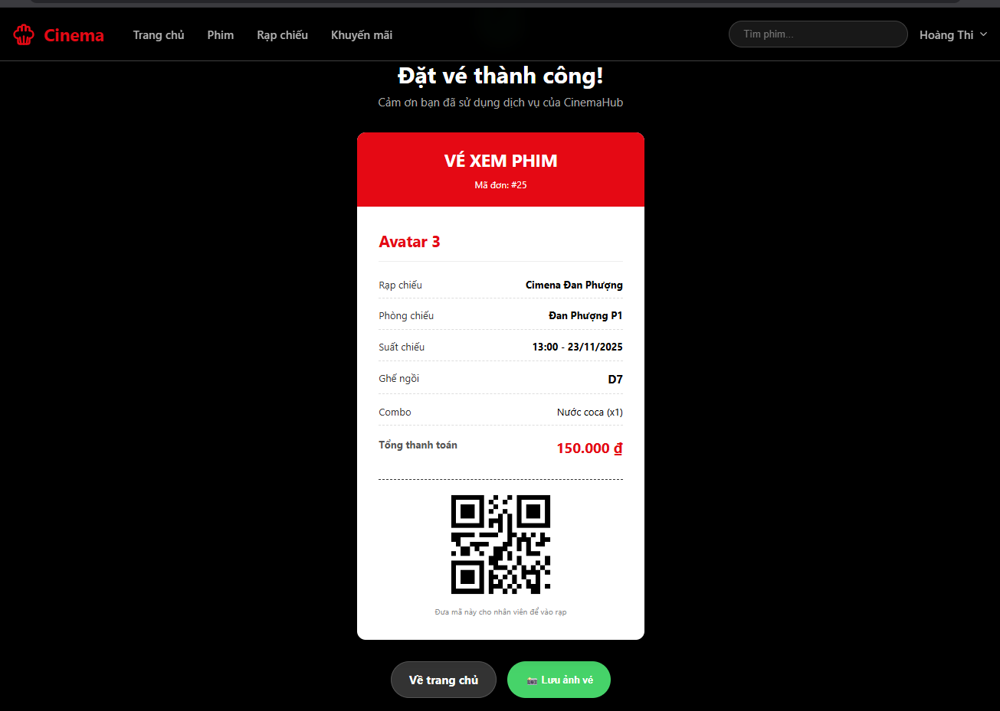
## ⚙️ 4. Cài đặt

### 4.1. Cài đặt công cụ, môi trường và các thư viện cần thiết

- Tải và cài đặt **XAMPP**  
  👉 https://www.apachefriends.org/download.html  
  (Khuyến nghị bản XAMPP với PHP 8.x)

- Cài đặt **Visual Studio Code** và các extension:
  - PHP Intelephense  
  - MySQL  
  - Prettier – Code Formatter  
### 4.2. Tải project
Clone project về thư mục `htdocs` của XAMPP (ví dụ ổ C):

```bash
cd C:\xampp\htdocs
https://github.com/HOANGTHI2509/WEB_QUAN_LY_DAT_VE_XEM_PHIM.git
Truy cập project qua đường dẫn:
👉 http://localhost/BTL_MO/View/user/index.php.
```
### 4.3. Setup database
Mở XAMPP Control Panel, Start Apache và MySQL

Truy cập MySQL WorkBench
Tạo database:
```bash
CREATE DATABASE IF NOT EXISTS ccinema_db
   CHARACTER SET utf8mb4
   COLLATE utf8mb4_unicode_ci;
```

### 4.4. Setup tham số kết nối
Mở file config.php (hoặc .env) trong project, chỉnh thông tin DB:
```bash

<?php
    function getDbConnection() {
        $servername = "localhost";
        $username = "root";
        $password = "";
        $dbname = "cinema_db";
        $port = 3306;
        $conn = mysqli_connect($servername, $username, $password, $dbname, $port);
        if (!$conn) {
            die("Kết nối database thất bại: " . mysqli_connect_error());
        }
        mysqli_set_charset($conn, "utf8");
        return $conn;
    }
?>
```
### 4.5. Chạy hệ thống
Mở XAMPP Control Panel → Start Apache và MySQL

Truy cập hệ thống:
👉 http://localhost/BTL_MO/View/user/index.php

### 4.6. Đăng nhập lần đầu
Đăng ký tài khoản mới

Sau vào Cơ sở dữ liệu chuyển quyền từ User sang Admin ( do mật khẩu mã hóa hash 1 chiều)

Đăng nhập sử dụng chức năng của quản trị viên.

    
